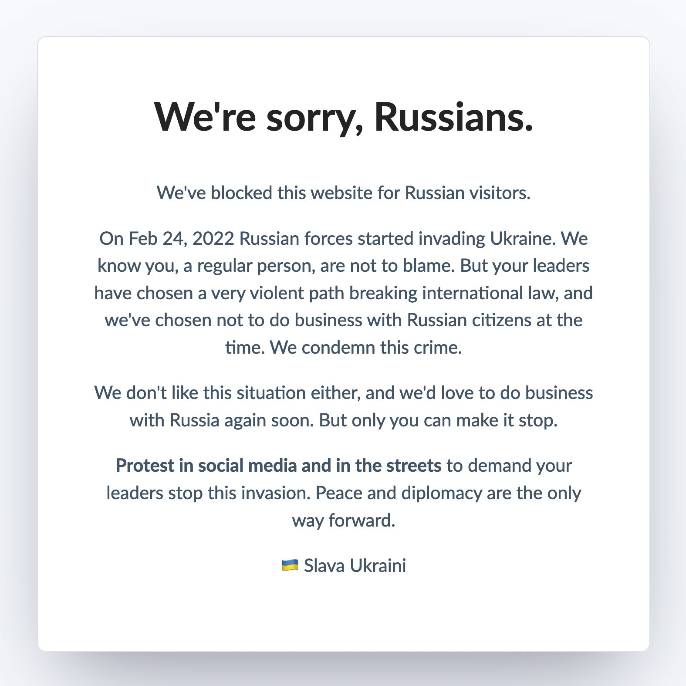

<h1 align="center">Laravel Embargoed</h1>

<p align="center">
Middleware to block all requests from Russia to any Laravel app and display a pro-Ukraine message instead 🇺🇦
</p>

---

### What does this middleware do?

This middleware checks the IP of visitors coming to your site for their origin. If it detects
a Russian IP, instead of continuing as normal it will block the visit and display a
pro-Ukrainian message.

The message looks as follows:



### Installation

1. Install the package via composer: `composer require pretzelhands/laravel-embargoed`
2. Add the `Pretzelhands\Embargoed\Http\Middleware\EmbargoOnRussia` middleware to your `app/Http/Kernel.php`

```php
<?php

// .. SNIP ..

protected $middleware = [
    \App\Http\Middleware\TrustProxies::class,
    \Fruitcake\Cors\HandleCors::class,
    \App\Http\Middleware\PreventRequestsDuringMaintenance::class,
    \Illuminate\Foundation\Http\Middleware\ValidatePostSize::class,
    \App\Http\Middleware\TrimStrings::class,
    \Illuminate\Foundation\Http\Middleware\ConvertEmptyStringsToNull::class,
    \Pretzelhands\Embargoed\Http\Middleware\EmbargoOnRussia::class // Middleware added!
];

// .. SNIP ..
```

The middleware will be active from then on and block all visits from Russia.

### Other technologies

This middleware is supported in a variety of different technology stacks. You can find an exhaustive list in [this repository](https://github.com/rameerez/embargoed-list)

### Collaborate

Please feel free to contact me, [@pretzelhds](https://twitter.com/pretzelhds) or fork this to port it to other platforms, or make PRs to this repo to collaborate.
